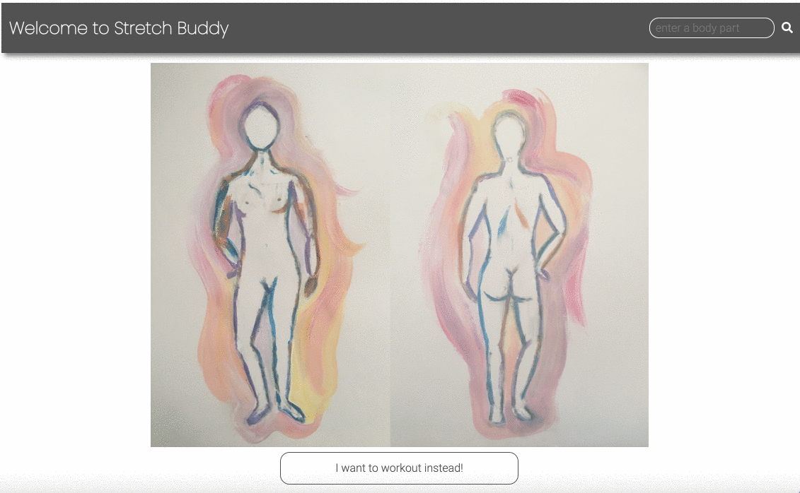
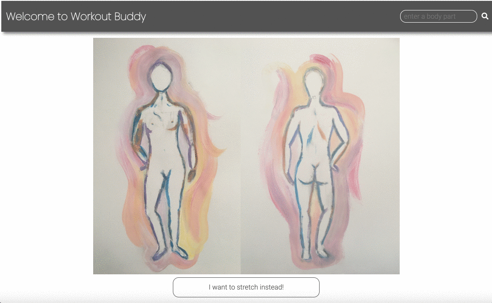

# Stretch Buddy
A stretching and workout tool built on React Hooks, Node.js, and MongoDB using the Youtube API.

---

## Table of Contents
- [Install](#install)
- [Tech Stack](#tech-stack)
- [Features](#features)

---

## Install

Set a **TOKEN** environment variable in a .env file or directly in docker-compose to be able to access the Youtube API through the search functionality.
> Example: TOKEN="Your Youtube API Token"

Run `docker-compose up` and navigate to http://localhost:3000 to see the front-end application.

---

## Tech Stack

   * [Node.js](https://nodejs.org/en/)
   * [Express](https://expressjs.com)
   * [AWS - EC2](https://aws.amazon.com/ec2/?ec2-whats-new.sort-by=item.additionalFields.postDateTime&ec2-whats-new.sort-order=desc)
   * [Docker](https://www.docker.com/)
   * [React Hooks](https://reactjs.org/docs/hooks-intro.html)
   * [SVG](https://developer.mozilla.org/en-US/docs/Web/SVG)
   * [MongoDB](https://www.mongodb.com/)
   * [Youtube API](https://developers.google.com/youtube/v3)

---

## Features

### Get a Video Targeting a Specific Body Part

The user can click on the body part that they would like to target in their stretch or workout and a Youtube video will pop up. The website is configured to respond to user interaction for 30 different body parts.

## Toggle Between Stretching and Working Out

The user is able to toggle between receiving stretching and working out videos.

## Search Feature

The user also has the ability to enter a body part into the search bar and receive a stretch or a workout specific to that body part.

